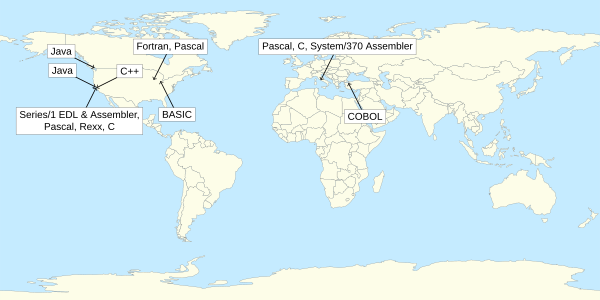

# About Me

{:.right width="156" height="156" srcset="images/profile-2x.jpg 2x"}
I'm an independent programmer, typographer, and system administrator.
I write software for the Java platform, design books with the LaTeX typesetting system, and manage systems running the Ubuntu operating system.

The path I took in learning programming languages was: *BASIC → Fortran → Pascal → COBOL → Series/1 EDL → Series/1 Assembler → Rexx → C → System/370 Assembler → C++ → Java*.
The path I took in learning human languages was: *English → French → Italian → French*, although I could still use a few more lessons in French.

## Experience

I have worked as a software developer in 🇹🇷&nbsp;Türkiye, 🇺🇸&nbsp;the United States, 🇮🇹&nbsp;Italy, and 🇨🇦&nbsp;Canada.

<picture>
<source media="(prefers-color-scheme: light)" srcset="images/mypath-1x.png 1x, images/mypath-2x.png 2x">
<source media="(prefers-color-scheme: dark)" srcset="images/mypath-1x-dark.png 1x, images/mypath-2x-dark.png 2x">

</picture>

**Bowling Green, Ohio**
: My first experience writing software was during a summer session for high-school students at Bowling Green State University, where I learned how to program in BASIC.

**Evanston, Illinois**
: I studied general programming concepts in Fortran and computer science concepts in Pascal at Northwestern University, where I majored in mathematics.

**Bursa, Türkiye**
: My first paid job as a programmer was a summer internship at Bursa Uludağ University, where I wrote accounting software in COBOL on a Burroughs mainframe.

**Palo Alto, California**
: I joined IBM as a systems programmer implementing communication protocols for the Series/1 minicomputer.
I contributed to the IBM Series/1 EDX Communications Facility, written in Series/1 EDL and Assembler, and the IBM OSI/Communications Subsystem, written in Pascal.
I completed courses at Stanford University in numerical analysis and in UNIX and C programming.

**Rome, Italy**
: On assignment in Rome, I developed the host side of a high-speed data pipe between an IBM mainframe and a UNIX workstation in C and System/370 Assembler for IBM OSI Connect.

**Cupertino, California**
: Back in California, I worked for IBM at Taligent on the Taligent CommonPoint Application System, an application framework written in C++ for personal computers and UNIX workstations.

**San Francisco, California**
: After leaving IBM, I started my own business as a managing member of Volano LLC in the states of California and Washington.
I learned Java by writing the VOLANO chat server, a proprietary software package licensed to customers in 50 countries around the world.

**Vancouver, British Columbia**
: I now work full time on open-source software and have contributed to the OpenJDK, OpenJFX, Apache NetBeans, and Reproducible Builds projects.
I am a member of the OpenJDK Organization and an OpenJFX Committer.
