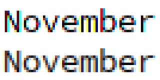
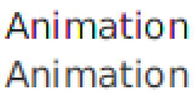

# Welcome

I'm John Neffenger, an independent software developer doing business as *Status Six Communications* in Vancouver, British Columbia, Canada.

## Programming

Some of my open-source contributions are described below.
In February 2020, I published the VOLANO™ chat server under an open-source license.
In 2019, I ported JavaFX, the Java application framework, to devices with e-paper displays.
In 2018, to prepare for the JavaFX project, I learned how to work with the OpenJDK community by fixing two font bugs that had bothered me for years.

### VOLANO Chat Server

{:.right width="160" height="96"}
I wrote much of the VOLANO chat server and applets in the spring of 1996.
During the following decade, the software became frozen in time at Java version 1.1 mostly due to the dominance of the [Microsoft Java Virtual Machine][msjvm] in Internet Explorer.
In the decade after that, it remained frozen in time mostly due to me.
Now, more than two decades after launching the proprietary software, I hope to breathe some life back into it as an [open-source project][volano].

### JavaFX on E-paper

{:.right width="160" height="160"}
While attending the SIGGRAPH conference in Vancouver, I was fascinated by an exhibit in the Art Gallery called [*Lineographs*][lineographs], by Joseph Farbrook.
It was the first time I had seen [animation with electronic ink][dancer], and it was beautiful.
I was determined to reproduce the artwork on my own, but I soon discovered how difficult that would be.
The documentation was hard to find, buried deep in manuals for embedded programmers, and provided only a native C-language interface to the device driver.
I wanted to use a cross-platform language and framework that would let me test applications on my desktop computer and run them unmodified on the device.
I wanted a framework like Java and JavaFX, Dart and Flutter, or Python and Qt, yet nothing like that existed.
Java and JavaFX, though, already had much of what I needed to make it work.

So I added the support to JavaFX and contributed the code to the OpenJDK project.
I submitted the code in two parts consisting of 1,831 new lines of code: 1,634 in Java and 197 in C.

1. The first part adds a JavaFX platform for Linux systems with e-paper displays, such as the Amazon Kindle and Rakuten Kobo e-readers.
See [Issue #339][openjdk-jfx-339] for details on the motivation and design of the new platform and [Pull Request #369][openjdk-jfx-369] for the implementation.
It is available in JavaFX 13 or later.

2. The second part adds support for additional device models.
See [Issue #521][openjdk-jfx-521] for details and [Pull Request #60][jfx-60] for the implementation.
It will be available in JavaFX 15 or later.

I also developed a separate JavaFX application to test the support for e-paper displays, published in my repository "[JavaFX on E-Paper][epd-javafx]."

### Java Font Fix

{:.right width="160" height="80"}
For 10 years, every time I downloaded a new release of Java, the first thing I did was check whether the font bug had been fixed.
And for 10 years, the bug was still there: color fringes so severe that it was impossible to use.
I was ready to abandon the platform altogether if it wasn't going to be fixed.
It was as if the developers of Java couldn't even see the bug!

As it turns out, that was precisely the problem: the developers of Java couldn't even see the bug.
It didn't happen on their systems running Oracle Linux.
To solve the problem, I created the repository "[OpenJDK Freetype Font Fix][openjdk-freetype]," which explained the long and convoluted history of the bug and provided a two-line fix.
My fix is available in Java 12 or later and has been back-ported to the Java 8 and Java 11 Long Term Support releases.

### JavaFX Font Fix

{:.right width="160" height="80"}
Before trying to fix the Java font bug, I started first with the same bug in JavaFX.
It can be particularly challenging to report bugs about fonts.
With so many variations, from anti-aliasing and hinting to subpixel rendering and filtering, everyone has an opinion.
It is difficult to convince developers that what you're describing is really a bug and not just a personal preference.
By 2017, there were already two bug reports explaining the problem, but they were both closed as "Not an Issue."
Worse yet, JavaFX, unlike Windows, renders its text unhinted, so the developers were used to receiving bug reports complaining about the difference in the fonts.
By 2018, the bug had persisted for five years.
If I wanted to open yet another bug report and have it accepted this time, it was going to require some compelling evidence---and probably a fix, too.

I created [Issue #229][openjdk-jfx-229] to provide both the evidence and the fix, and my [Pull Request #235][openjdk-jfx-235] was merged into JavaFX within two days.
It is available in JavaFX 12 or later.
As with the Java font bug, because of a quirk in how the problem occurred, the developers of JavaFX couldn't see this bug either.

## Typography

I took on these projects to find out whether I could automate the production of well-formatted books in plain text, HTML, EPUB, Kindle MOBI, and several PDF paper sizes, all from a single source written in LaTeX.
The results were even better than I had expected, thanks to the great open-source tools in LaTeX, HeVeA, ImageMagick, Potrace, and Inkscape.

### *Wild & Woolly*

{:.left width="80" height="128"}
I designed the e-book versions of [*Wild & Woolly: A Journal Keeper's E-book*][play-woolly], by Alfred DePew, and automated the production of PDF files in A4, A5, and A6 paper sizes.
Click the *Free sample* button on the Google Play page to view a sample of the work.

### *The Melancholy of Departure*

{:.left width="80" height="113"}
I designed the e-book versions of [*The Melancholy of Departure*][play-melancholy], by Alfred DePew, and automated the production of PDF, EPUB, and Kindle MOBI files.
Click the *Free sample* button on the Google Play page to view a sample of the work.

[lineographs]: http://s2014.siggraph.org/attendees/art-gallery/events/lineographs.html
[dancer]: https://www.farbrook.net/lineographs/
[msjvm]: https://en.wikipedia.org/wiki/Microsoft_Java_Virtual_Machine
[volano]: https://github.com/jgneff/volano
[openjdk-jfx-339]: https://github.com/javafxports/openjdk-jfx/issues/339
[openjdk-jfx-369]: https://github.com/javafxports/openjdk-jfx/pull/369
[openjdk-jfx-521]: https://github.com/javafxports/openjdk-jfx/issues/521
[jfx-60]: https://github.com/openjdk/jfx/pull/60
[epd-javafx]: https://github.com/jgneff/epd-javafx

[openjdk-freetype]: https://github.com/jgneff/openjdk-freetype
[openjdk-jfx-229]: https://github.com/javafxports/openjdk-jfx/issues/229
[openjdk-jfx-235]: https://github.com/javafxports/openjdk-jfx/pull/235

[play-woolly]: https://play.google.com/store/books/details/Alfred_DePew_Wild_Woolly?id=8c3_AAAAQBAJ
[play-melancholy]: https://play.google.com/store/books/details/Alfred_DePew_The_Melancholy_of_Departure?id=jc3_AAAAQBAJ
